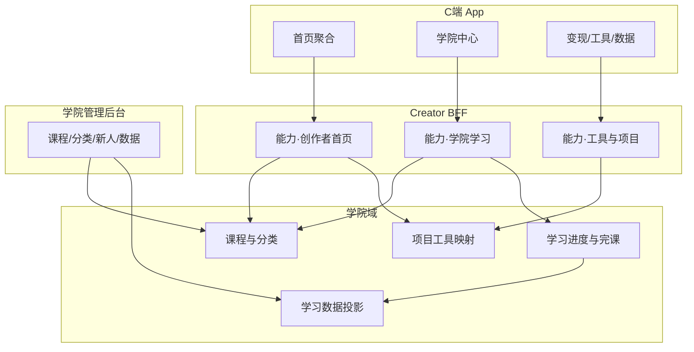
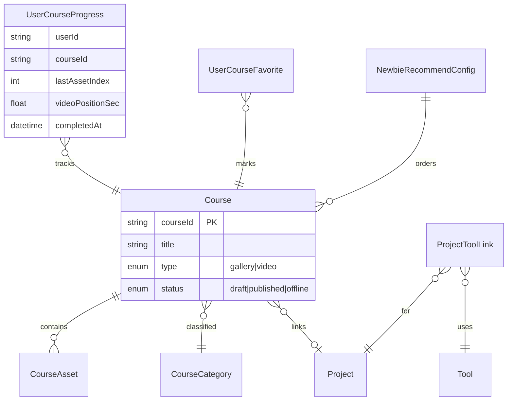

# Architecture Spine — FR-021 · 2.0优化

## Design Paradigm

**Layered BFF + Admin Write Domain**

- **C 端 App BFF（读聚合）**：首页、学院、变现/工具/数据 Tab 只消费**已组装**的下发 DTO；不在客户端拼完课、不二次解释推荐原因文案。
- **学院域服务（写模型）**：课程/分类/新人推荐/进度上报由后台与 C 端各走明确能力；学习进度与完课**单一计算点**。
- **运营 Admin**：学院四模块直连域服务写 API；与 C 端 BFF 共享同一套实体与完课口径，禁止各写一套字段表。



## Inherited Invariants

| Inherited | From parent | Binds here |
| --- | --- | --- |
| 迭代 Demo 不发真实 HTTP、禁止发明路径 | `ITERATION-FR-GUIDE` + FR-006 brownfield 模式 | Demo 仓仅 Mock/内存；契约用**能力名** |
| C 端橙色体系、iframe Mockup | `ITERATION-FR-GUIDE` §二 | 生产 UI token 以 UX `DESIGN.md` 为准 |
| PRD/UX spines 优先于 mock | PRD FR-021 §0 | 实现冲突上报，不 silent 改 Demo |
| 站内已登录 | PRD 隐含 / 迭代惯例 | 能力入参带 `userId`；未登录走现网网关 |

## Invariants & Rules

### AD-1 — 学院域与首页聚合边界

- **Binds:** Epic 1–4, FR-1..11, FR-15..18
- **Prevents:** 首页模块直接写课程表、或在 Admin 保存时改首页 JSON 配置绕域服务
- **Rule:** 课程/分类/新人推荐/进度/完课属 **AcademyDomain**；首页只通过 BFF 能力 **`创作者首页`** / **`学院学习`** 读投影。首页「找项目/榜单/动态」读 **ProjectFeed / RankFeed / DynamicFeed**（现网或本 FR 只读聚合），不得写入学院表。

### AD-2 — 完课口径单一真相源

- **Binds:** FR-11, FR-15, NFR2, Story 4.2, 6.3
- **Prevents:** C 端用本地 JS 判定完课而后台用另一套 SQL
- **Rule:** **`学习进度上报`** 持久化后，由 **ProgressSvc** 派生 `completedAt`：图集 `lastAssetIndex >= assetCount-1`；视频 `positionSec / durationSec >= 0.90`。C 端展示进度；**`学习数据`** 只读同一投影，禁止 Admin 手改完成率。

### AD-3 — 项目↔工具映射归属

- **Binds:** FR-6, FR-7, Epic 2
- **Prevents:** 工具 Sheet 文案写死在 App；找项目列表 N+1 调工具详情
- **Rule:** **`project_tool_link`** 仅存 `projectId`, `toolId`, `sort`, `recommendReason`；名称/描述/适用范围 **join 工具市场 ToolCatalog 主数据**（D-4），禁止本 FR 维护平行工具主档。BFF **`创作者首页`** 一次下发项目行 + 组装后的 `tools[]`。

### AD-4 — 今日路径仅为读模型 + 本地 chrome

- **Binds:** FR-8, FR-9, Epic 3
- **Prevents:** 拖拽位置写服务端；路径内容与找项目列表不一致
- **Rule:** 路径三项推荐来自 **`今日路径推荐`**（配置或策略服务）；气泡拖拽坐标 **仅客户端 localStorage**（按 userId+day 键），不上报。切换非首页 Tab 不销毁服务端状态。

### AD-5 — 数据 Tab 示例与账本隔离

- **Binds:** FR-14, NFR3
- **Prevents:** 演示 Sheet 写入真实收益表或触发分析任务
- **Rule:** **`数据概览`** 真实分支读账户/订单投影；**`示例数据`** 分支响应带 `isDemo: true`，全链路禁止调用入账/结算写接口；客户端 `sessionStorage` 标记演示态直至「退出演示」。

### AD-6 — 下发组装唯一实现

- **Binds:** FR-2, FR-4, FR-10, FR-16, Epic 6
- **Prevents:** Admin 列表字段与 C 端学院卡片各维护过滤逻辑
- **Rule:** 与 FR-006 相同模式：**后端（或 BFF）单一 assemble 函数** — 课程 `status=published` 才进 C 端；分类禁用不进频道；新人推荐列表由配置 ID 顺序解析为课程 DTO。字段可见性表见 `fe-be-contract.md` §2。

### AD-7 — Demo 迭代交付与生产代码分离

- **Binds:** FR-19, `demo/iteration/*`
- **Prevents:** 生产包携带 `rb-demo-workspace` 切换器或 Shadow DOM 后台
- **Rule:** **`creator-home-2-opt-demo.html`** 可内存 Mock + `sessionStorage`；生产 Admin 走现网学院后台路由，C 端走 App 壳。Demo 双端切换 **不进入** AD-1 生产依赖图。

### AD-8 — 样式作用域

- **Binds:** NFR4, UX-DR6
- **Prevents:** 数据页黑金污染首页
- **Rule:** C 端 `#dataPage`（或等价 route module）样式 **scoped**；共享 token 来自 DESIGN frontmatter，禁止全局选择器改 Tab 外页面。

## Consistency Conventions

| Concern | Convention |
| --- | --- |
| Naming | 能力名中文·业务语义（`学院课程保存`）；实体英文 `Course`, `CourseCategory`, `UserCourseProgress`, `ProjectToolLink` |
| IDs | 课程 `courseId` 字符串全局唯一；分类 `categoryId`；项目/工具沿用现网 `projectId` / `toolId` |
| Dates | ISO8601 UTC 存储；C 端展示按用户 locale |
| Errors | BFF 统一 envelope `{ code, message, requestId }`；C 端 toast 用 `message` |
| Auth | 运营后台能力带 `operatorId` + 学院权限码；C 端带 `userId` JWT 声明 |
| Progress | 上报幂等：`userId+courseId+clientReportId`；乱序上报取 `max(lastAssetIndex)` / `max(positionSec)` |

## Stack

| Name | Version |
| --- | --- |
| 本仓库迭代 Demo | HTML/CSS/ES · V125 静态页 |
| C 端生产 | [ADOPTED] 现网右豹 App 技术栈（本仓库无源码，不绑定版本） |
| 学院 Admin 生产 | [ADOPTED] 现网管理后台（Vue/React 以现网为准） |
| 契约形态 | 能力名 + DTO（见 `fe-be-contract.md`）；联调前禁止写死 REST path 进本 FR 文档 |

## Structural Seed

```text
_bmad-output/planning-artifacts/
  prds/prd-YBDD2.0-2026-10-07/          # 需求
  ux-designs/ux-YBDD2.0-2026-10-07/     # UX spines
  epics-FR-021-2026-10-07.md            # 故事
  architecture/architecture-fr021-YBDD2.0-2026-10-07/  # 本 spine
demo/iteration/
  fr-creator-home-2-opt.html              # Sprint 入口
  creator-home-2-opt-demo.html            # 交互真源
```



## Capability → Architecture Map

| Capability / Area | Lives in | Governed by |
| --- | --- | --- |
| 创作者首页 | Creator BFF | AD-1, AD-3, AD-6 |
| 学院学习 / 进度上报 | Creator BFF + ProgressSvc | AD-2, AD-6 |
| 学院课程保存 / 上下架 | AcademyDomain + Admin | AD-2, AD-6 |
| 分类与新人推荐 | AcademyDomain + Admin | AD-6 |
| 学习数据 | AnalyticsSvc 读 ProgressSvc | AD-2 |
| 项目工具映射 | MapSvc + Admin 或运营配置 | AD-3 |
| 今日路径推荐 | 策略/配置服务 | AD-4 |
| 数据概览 / 示例 | Creator BFF + 账本只读 | AD-5 |
| 迭代 Demo | demo/iteration | AD-7 |

## Deferred

| 项 | 原因 |
| --- | --- |
| 具体 REST/gRPC path、网关路由 | 现网网关未在本仓库；联调时由平台组绑定能力名 |
| 榜单/动态/OPC 列表数据源 | 假定消费现网 Feed；若需新表在 Epic 1 Story 前单独评审 |
| 新手引导 rb122 | D-3 延后 |
| 设置工作台 | D-5 沿用现网，本 FR 不改 |
| 项目管理/工具管理菜单 | PRD Non-Goal |
| 今日路径推荐算法 | 可先配置静态 3 项；策略服务后换 AD-4 数据源 |
| 视频续播 CDN/断点续传细节 | 客户端播放器实现层 |
| 新手引导 rb122/rb124 | D-3：本刀延后，Demo 可保留 |
