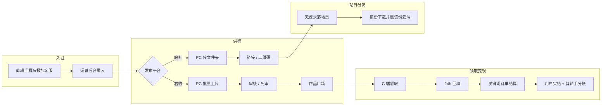
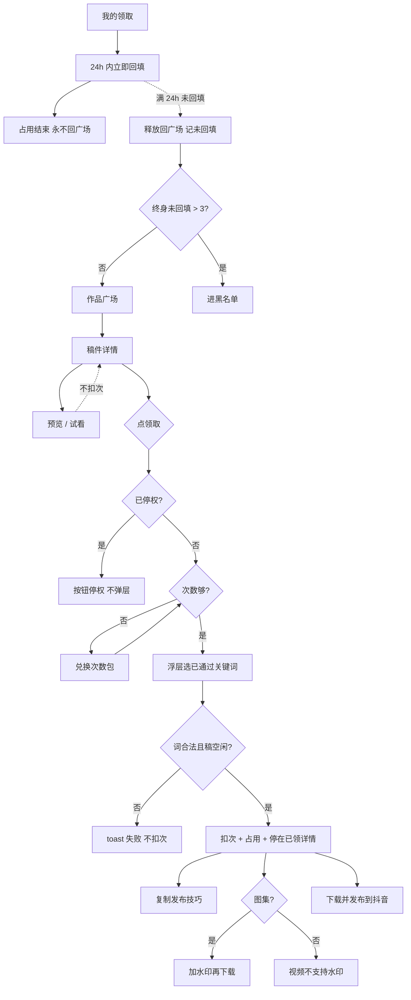
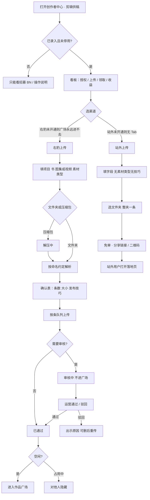
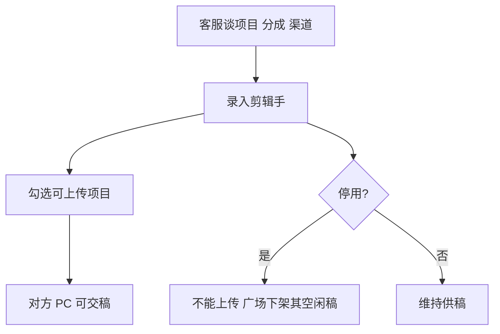
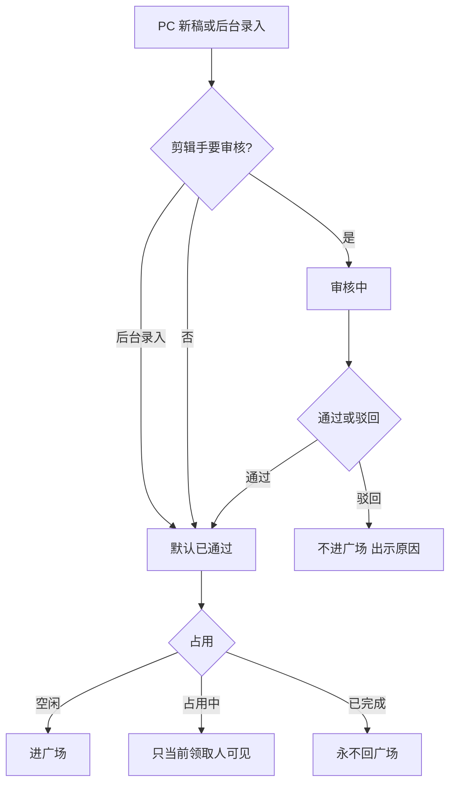
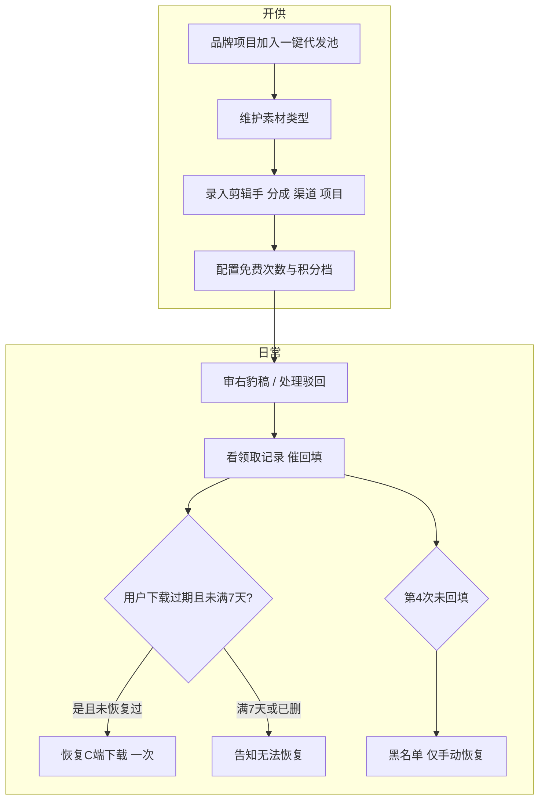
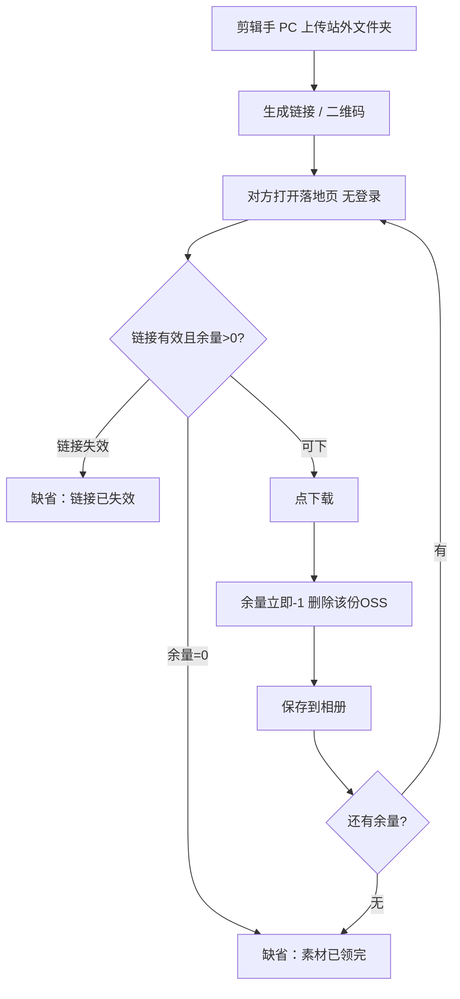
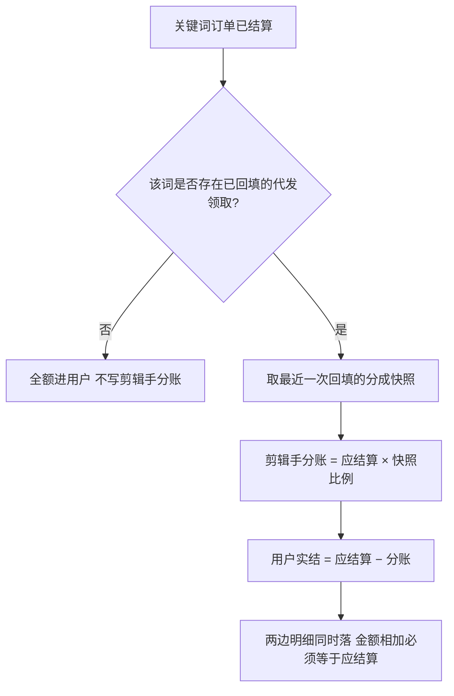
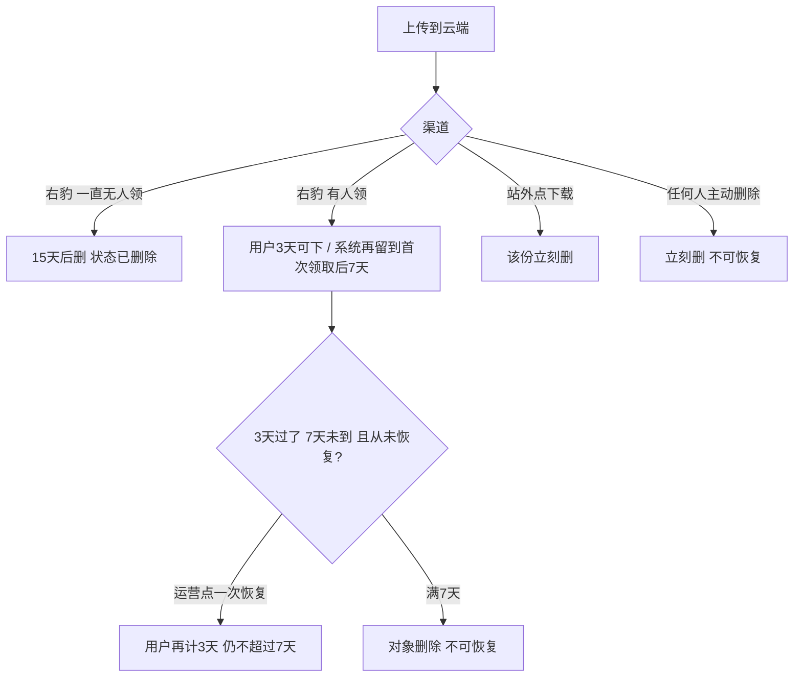

# 右豹「一键代发」· 各端功能介绍（面向运营）

> **读者：** 运营、客服、招商对接、值班排查。  
> **口径：** 按真实端侧讲「谁在哪做、能做什么、卡在哪、你要管什么」。不含研发编号与接口。  
> **分成、授权项目、是否免审** 以后台录入为准，口头承诺无效。  
> **Demo（同一页讲四个端，不拆页）：** `demo/iteration/fr-opc-yijian-daifa.html?tab=explain` → 业务解释「0 各端功能」。招商可编辑版：`?tab=pitch&pitch=ends`。左侧目录只滚动跳转。  
> 对外招商请用：`fr014-一键代发-对外招商介绍.md`。剪辑手上传手册：`specs/spec-fr014-yijian-daifa/剪辑供稿-操作说明.md`。

---

## 1. 一句话

**会做片的人在电脑交成片，不会做片但有项目、有词的人在 App 领成片去发。**  
关键词订单结算时，按领取当时锁定的分成，拆到用户和剪辑手。

站外是另一条路：剪辑手把文件夹做成链接 / 二维码，对方**不用登录、不选词、不回填**，按份下载。站外稿**不进**右豹作品广场。

---

## 2. 端侧对照（先认路）

| 端 | 谁用 | 入口 | 运营要记住的边界 |
|----|------|------|------------------|
| **C 端（App / 站内 H5）** | 领取用户 | 作品广场 → 稿件详情 → 我的领取 | 只能领、回填、下载发抖音；**不能上传** |
| **PC 创作者中心** | 已录入剪辑手 | 创作者中心 → **剪辑供稿** | **只有电脑能交稿**；未录入只能看招募 |
| **管理后台** | 运营 | 一键代发七个菜单 | 录入、审核、项目/素材/次数、停权恢复、下载恢复 |
| **站外 H5** | 剪辑手私域里的下载人 | 分享链接 / 二维码 | 无登录；点一次扣一份并删云端该份 |

四个端不要混讲：用户不会在 App 交稿；剪辑手不会在 App 管审核；站外用户不会走广场领取门禁。

---

## 3. 全业务总览

**运营值班一句话：** 站内看「供得上、领得走、回得上、分得清」；站外看「码能开、余量对、领完即空」。

---

## 4. C 端（用户 · App / 站内 H5）

### 4.1 这个端解决什么

给**没有制作能力、但已有项目资格和关键词**的人：找片 → 预览 → 领 → 限时回填 → 下载发抖音。列表和广场**不展示收益金额**，详情只出**分成比例**。

### 4.2 页面与功能

| 页面 | 用户能做什么 | 运营怎么解释 |
|------|----------------|--------------|
| **作品广场** | 按项目图标直选；搜索在项目下；筛剪辑师 / 素材 / 图集或视频 | 只出现：项目启用、剪辑手开通右豹且未停用、稿已通过、空闲、云端正常、素材类型启用。占用中的别人看不见 |
| **招募海报** | 看卖点、适合谁、客服码 | 和 PC 顶部 BN 是同一张海报。**没有申请表、没有上传** |
| **稿件详情（未领）** | 看标题、项目、书、剪辑师、分成比例、注意事项；图集最多预览 3 张；视频试看 5 秒 | 预览**不扣次、不占用、不能保存**。底栏：剩余次数、快捷提词、领取 |
| **稿件详情（已领）** | 复制「发布技巧」；图集可加水印；下载并发布到抖音 | 回填不从详情进，从「我的领取 → 立即回填」进该项目原回填页 |
| **领取浮层** | 次数不够兑积分档；次数够再选词 | **必须先选词**，系统不默认带入。词须是该项目「审核通过待发布」或「审核通过已回填」。词带书籍 ID 时须与稿件一致 |
| **我的领取** | 未回填 / 已回填 / 已超时 三态；下载、复制链接、立即回填 | 已超时 Tab **只收超时未回填**。立即回填按钮始终高亮，但已回填 / 已超时点了会提示不能再回填 |
| **添加水印** | 仅图集：拖文字、选字体字色背景、按间隔打水印后再下 | 视频点入口会提示暂不支持，按钮仍在，不进页 |
| **项目回填页（复用）** | 24 小时内补该项目已有字段 | 本产品不新造回填表。提交后占用结束，稿件**不再回广场** |
| **项目收益明细（复用）** | 结算后看到用户侧实结 | 代发才会拆账；广场/领取列表仍不出金额 |

### 4.3 领取门禁（客服必背，顺序不能跳）

1. **停权** → 按钮变成「已被停权，无法领取」，不弹任何层  
2. **次数** → 不够只打开兑换，不打开选词  
3. **选词** → 必须手选已通过词  
4. **资格 / 占用** → 稿不可领或已被占：失败、**不扣次**

成功：扣次（先扣当日免费，再扣已购）+ 占用 + 写分成快照。**已扣次数不退。**

### 4.4 次数怎么算

- 剩余 = **当日免费剩余 + 已购剩余**  
- 免费额度后台分 **工作日 / 节假日** 两套；跨自然日只重置免费，已购不清零  
- 节假日 = 周六日 ∪ 当年国务院放假日 − 调休上班日  
- 积分档同时在售最多 **4 档**；下架后不能新兑，已购次数仍在  

### 4.5 时限与停权

| 规则 | 用户侧表现 | 运营动作 |
|------|------------|----------|
| 领取后 **24 小时**未回填 | 稿释放回广场；记 1 次未回填；次数不退 | 原领取人未停权可再领（再扣次） |
| 终身未回填 **超过 3 次**（第 4 次超时） | 停权，不能再领任何稿 | 只能后台黑名单手动恢复 |
| 领取后 **3 天**下载窗 | 未回填 / 已回填可官方下载；结束显示「下载已失效」 | 满 7 天云端删了就不能恢复 |
| 已超时记录 | 卡片「回填已超时」，不能下 | 不要跟用户说「被别人领走了」——超时记录固定这句 |

下载 / 复制链接三套提示（优先：时效过期 > 停权 > 24h 未回填）：

- 3 天已过：「当前稿件下载时效已过期」  
- 未及时回填且 3 天未过：「当前任务未及时回填，下载链接已失效」  
- 已停权且 3 天未过：「您已违反平台规则，超过3次未回填；下载链接已失效」

用户已经保存到手机的文件**不回收**。

### 4.6 C 端流程图

---

## 5. PC 端（剪辑手 · 创作者中心）

### 5.1 这个端解决什么

给**已录入**的剪辑手：看授权与业绩、批量交稿、看审核与占用、给站外夹子出码。  
**手机 App 没有上传口。** 未录入 / 已停用：看板缺省，不能传，顶部招募 BN 仍可打开。

### 5.2 页面与功能

| 模块 | 剪辑手能做什么 | 运营怎么解释 |
|------|----------------|--------------|
| **剪辑供稿菜单** | 顶部招募 BN + 下方看板 | 单一菜单，不改项目中心 / 作品管理 / 收益中心 |
| **操作说明** | 页内看手册 | 未录入也能看，方便客服让对方先自学命名规则 |
| **看板四格** | 已授权项目数、上传数、被领取数、已产生收益 | 点「已授权项目」数字弹名单，**中间没有项目栏** |
| **收益数据** | 按日 / 月 / 自定义看已结算；明细抽屉可导出 CSV | **只含右豹端稿**。站外不进这张表 |
| **最近上传** | 项目、书（ID/标题/链接）、稿件、类型、审核、时间 | 看板「上传数」含站外；「被领取」不含站外 |
| **上传 · 右豹** | 先填项目/书/类型/素材，再选文件夹或压缩包，确认表后队列传 | 一次一个项目 + 一本书 + 一种类型（图集或视频） |
| **上传 · 站外** | 填共享字段（无素材类型、无压缩包、无发布技巧），整夹一条 | 免审、不进广场；生成链接和二维码 |
| **上传清单** | 右豹 / 站外两个 Tab（没开通的 Tab 看不见） | 右豹：上传三态 + 审核三态。仅**空闲且正常**可删。删除后云端立刻没了，**不能恢复** |

### 5.3 右豹交稿要点（客服可照念）

1. 身份行应是：昵称 · 右豹 ID · 分成 xx%。写着「未录入」就先加客服。  
2. 三步不能颠倒：**填字段 → 选成片 → 核对上传**。  
3. 视频：文件名（去后缀）= 标题；只认常见视频格式。  
4. 图集：一个文件夹一条，文件夹名 = 标题；不要把所有图平铺或再套一层。  
5. 压缩包会先「解压中」；解压中 / 上传中不要关窗。  
6. 发布技巧可手改，或整表「AI 生产发布技巧」；空技巧也能传。  
7. 「稿件需要审核 = 是」→ 审核中等运营；「否」→ 新稿默认已通过。改「否」**不回溯**已经在审的旧稿。  
8. 占用中 / 已完成不能删。已删除行还在清单里，只是不能再下、不能再分享。

### 5.4 成片会留多久（对剪辑手讲清楚，避免当网盘）

| 情况 | 云端 | 备注 |
|------|------|------|
| 一直没人领 | 上传起 **15 天**删除 | 稿件状态变已删除 |
| 有人领过 | 领取人约 **3 天**可下；云端到首次领取后约 **7 天** | 后台最多给用户恢复一次下载（仍不超过 7 天） |
| 自己点删除 | **立刻**删云端 | 不可恢复 |
| 站外每下一份 | 该份立刻从云端去掉 | 夹子按「已领 x / 共 x」计 |

### 5.5 PC 流程图

---

## 6. 管理后台（运营工作台）

后台一共 **七个业务页**。广场 Banner 复用平台已有能力，**本产品不单开 Banner 配置页**。

### 6.1 剪辑手管理

**你做什么：** 客服谈完后在这里录入，对方才能在 PC 上传。

| 必填 | 说明 |
|------|------|
| 右豹 ID | 唯一；对方创作者账号 |
| 分成比例 | 领取成功时锁定快照；以后改比例**不回溯**已领记录 |
| 备注 | 只进详情，不出现在列表 |
| 稿件需要审核 | 默认「是」。否 = 之后新稿免审 |
| 发布平台 | 右豹 / 站外，至少选一个 |
| 可上传项目 | 只能勾选「项目管理」里已有的；一个都不勾 = PC 不能传 |

**列表还看：** 已上传数、已被领取数（占用中 + 已完成）、累计大小。  
**表头四统计（随筛选变）：** 剪辑手数量、累计稿件数、累计大小、累计结算收益（站内 + 站外）。

**两套收益抽屉：**

- **站内：** 用户领取后，关键词订单结算分账；明细含领取人。  
- **站外：** 该剪辑手右豹 ID × 项目-书籍 的**自产关键词**收益；明细不含领取人。  
列表不出待结算。

**停用：** 不看占用、不看名下是否还有稿，可直接停用。停用后 PC 点上传会提示权限收回；其已通过空闲稿**立刻不进广场**。名下仍有稿件则**不能删除该剪辑手**。

### 6.2 稿件管理（右豹 / 站外两个 Tab）

**右豹：** 审 PC 新稿，或运营直接「录入稿件」（视为已审、默认已通过）。看项目、书、大小、张数/1、下载链接、发布技巧、占用（空闲 / 占用中 / 已完成）、稿件状态（正常 / 已删除）、审核（审核中 / 已通过 / 已驳回）。

- 审核中：可单条或批量通过 / 驳回（驳回原因必填）  
- 已通过：**不能再驳回**  
- 删除：占用中、仍有未超时领取、已删除的不能删；删了云端同步没、**不能恢复**，行还在  

**站外：** 无发布技巧、无素材类型、无审核。看「x 个素材（已领 x 个）」、空闲 / 部分领取 / 已领完、分享链接与二维码。

**新建门禁：** 右豹没有启用中的剪辑手 / 项目 / 素材类型时，不要打开新建弹窗。站外不要素材类型。

### 6.3 领取记录

**你做什么：** 查谁领了哪份、选了什么词、回填视频链接有没有。

- 必看：项目、书籍、剪辑手（右豹 ID + 名称）、回填信息（未回填为 —）  
- 操作只有「稿件详情」  
- **恢复 C 端下载：** 下载链接旁的文字操作。每份稿件**只能一次**；用户重新计 3 天，且不能超过系统 7 天。满 7 天云端已删则按钮无效  
- **不能**改领取状态、不能删记录  
- 站外下载**没有**「恢复 C 端下载」

### 6.4 黑名单

终身第 4 次未回填自动进来。状态：停权中 / 已恢复。只有「恢复」。行不删。没有用户自助解禁。

### 6.5 项目管理

从**现有品牌项目库**带出名称 + Logo，禁止本页手填新建。已加入过的再保存会拦截。

- 可启用 / 禁用 / 排序  
- **不要**在本页维护已通过关键词（词仍走原申词流程）  
- 禁用：不能上传、不进广场；仍有稿则不能删项目  

### 6.6 素材类型

PC 上传必选；广场「选择素材」只筛这个字段。启用才出现。禁用后，对应空闲已通过稿**立刻从广场消失**。仍有稿件占用该名称则不能删，只能停用。

### 6.7 次数商品

- 工作日免费次数、节假日免费次数（均 ≥ 0）。保存「今天这类天」对应字段后，**当前用户免费剩余立刻变成该值**  
- 档位：x 次 / y 积分 + 原价（原价 ≥ 现价）；同时在售最多 4 个；可改价、下架  
- 购买人数只读（该档去重用户数）  
- 新增档位默认下架，避免一建档就对外可兑  

### 6.8 运营日常流程图

---

## 7. 站外 H5（链接 / 二维码落地页）

### 7.1 这个端解决什么

剪辑手或渠道已有私域：把成片夹子发出去，对方**扫码即下**。  
**不是**右豹用户领取：无登录、无选词、无次数、无回填、无水印、不进广场、不走 3/7 天下载恢复。

### 7.2 页面表现

| 状态 | 页面 | 点下载会怎样 |
|------|------|----------------|
| 还有余量 | 封面、标题、项目、书、类型 +「下载稿件」；可写「无需登录」 | **立刻**余量 −1，并删除该份云端文件，再播保存动效 |
| 已领完 | 缺省「素材已领完」，**无下载按钮** | — |
| 稿已删 / 链接失效 | 缺省「链接已失效」 | — |

PC / 后台立刻同步「x 个素材（已领 x 个）」。最后一份下完，本页切到「已领完」。这是余量空了，不是整夹一次性清桶——未领到的文件若还在，整夹仍按 **15 天未领清理**规则走系统删除。

### 7.3 站外流程图

**对商务 / 客服：** 站外收益按「剪辑手自产词」口径看后台抽屉，**不要**承诺和站内领取分账同一套。具体以商务书面确认为准。

---

## 8. 跨端：钱怎么分（结算，不单独开页）

发生在平台**关键词订单变为已结算**时，写入双方已有的「项目收益明细」。待结算只累计，不写明细。

运营口径：

- 没回填、已超时的领取**不能**把该词变成「代发词」  
- 一词领过多份：分账跟 **最近一次回填** 那份稿、那位剪辑手、那次快照  
- **先结算后回填：已经落过的那笔订单不回溯**；只影响之后的结算  
- 同一笔订单 + 同一个词只入账一次  
- 改剪辑手当前分成，**不算旧账**

用户明细标题大意：某时某项目结算收益到账（实结）元，描述含关键词 ID、应结算、代发分账、实际结算。  
剪辑手明细标题大意：某时某项目作品代发收益到账（分账）元，描述含稿件 ID。

---

## 9. 跨端：云端文件（客诉高频）

全部成片在阿里云。站内、站外两条链**不要混用恢复按钮**。

| 用户说法 | 正确答复 |
|----------|----------|
| 我领过但下不了了 | 先看是否超 3 天、是否 24h 未回填、是否停权；未满 7 天且该稿没恢复过 → 后台恢复一次 |
| 让剪辑手再传同一条当恢复 | 主动删除过的不能从云端捞回；只能重新上传成新稿 |
| 站外码打不开下载 | 看是领完还是链接失效；站外不能「恢复 C 端下载」 |
| 广场突然没了某类片 | 查：项目是否禁用、素材类型是否停用、剪辑手是否停用/关掉右豹、稿是否占用中或已删除 |

---

## 10. 运营红线（对外别讲错）

1. 不说「扫海报就等于已入驻」——必须后台录入。  
2. 不说 App 能交剪辑供稿。  
3. 不说平台替用户发抖音——只提供成片、发布技巧、下载后拉起抖音相册。  
4. 不承诺保底领取量、保底收益。  
5. 广场 / 我的领取 **不要承诺展示金额**。  
6. 超时释放 **不退次数**。  
7. 停权没有自助解禁。  
8. 站外用户不是右豹领取用户，不要让他们去广场找同一份稿。

---

## 11. 客服速查表

| 场景 | 先看哪一端 | 常见处理 |
|------|------------|----------|
| 剪辑手传不了 | PC 身份行 + 后台剪辑手 | 未录入 / 停用 / 未勾项目 / 未开通对应渠道 / 项目禁用 |
| 传了广场没有 | 后台稿件 | 审核中、驳回、占用中、项目/素材/剪辑手未启用、未开通右豹、已删除 |
| 用户领不了 | C 端详情 | 停权、次数、没已通过词、书 ID 不一致、稿已被占 |
| 用户说要退次数 | — | 规则不退；解释占用失败才不扣 |
| 回填不了 | 我的领取 | 是否已超 24h、是否已回填 |
| 下载失效 | 领取记录 | 3 天窗、超时、停权、7 天云端；符合条件再恢复一次 |
| 分成和现在后台比例不一致 | 领取当时快照 | 改比例只影响之后新领取 |
| 站外余量对不上 | PC/后台站外 Tab | 以下载次数为准；每下一份就少一份云端 |

---

## 12. 相关材料

| 材料 | 给谁 |
|------|------|
| 本文 | 运营内部培训、值班、客服 |
| `fr014-一键代发-对外招商介绍.md` + `fr014-招商物料/` | 剪辑手招募、商务 |
| `剪辑供稿-操作说明.md` | 发给已录入剪辑手 |
| Demo：`demo/iteration/fr-opc-yijian-daifa.html` | 对照页面与流程（非生产数据） |
