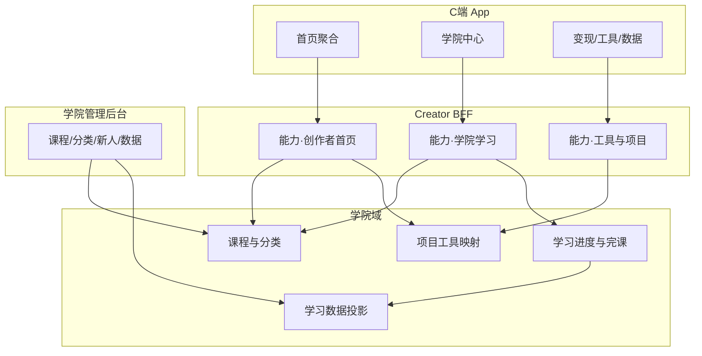
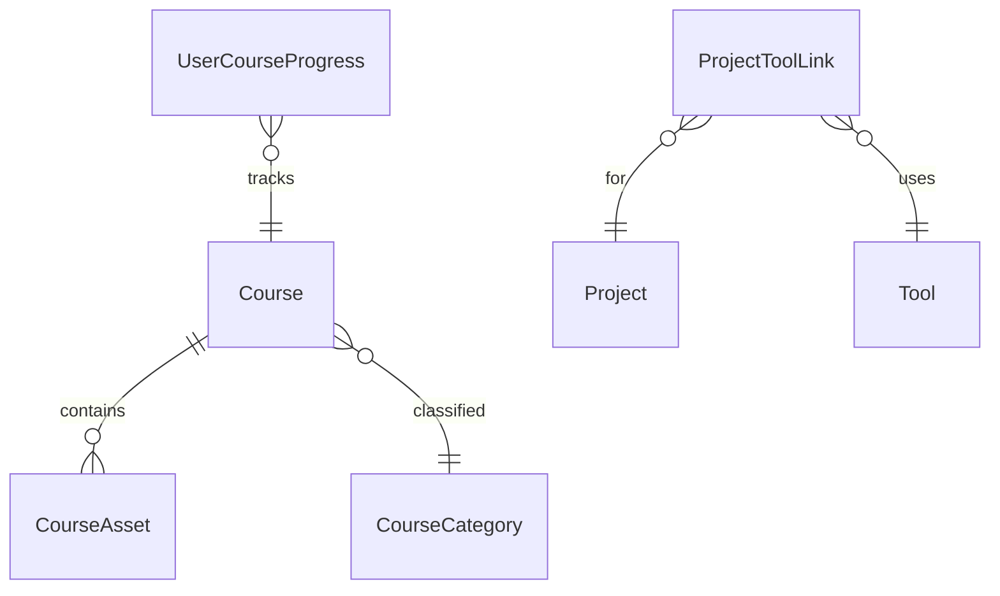

# FR-021 架构图（摘自 spine）

完整 AD 条文见 adopted companion `ARCHITECTURE-SPINE.md`。

```mermaid
flowchart TB
  subgraph client [C端 App]
    Home[首页聚合]
    Academy[学院中心]
    Tabs[变现/工具/数据]
  end
  subgraph bff [Creator BFF]
    HomeAgg[能力·创作者首页]
    AcademyAgg[能力·学院学习]
    ToolAgg[能力·工具与项目]
  end
  subgraph domain [学院域]
    CourseSvc[课程与分类]
    ProgressSvc[学习进度与完课]
    AnalyticsSvc[学习数据投影]
    MapSvc[项目工具映射]
  end
  subgraph admin [学院管理后台]
    AdminUI[课程/分类/新人/数据]
  end
  Home --> HomeAgg
  Academy --> AcademyAgg
  Tabs --> ToolAgg
  HomeAgg --> CourseSvc
  HomeAgg --> MapSvc
  AcademyAgg --> CourseSvc
  AcademyAgg --> ProgressSvc
  ToolAgg --> MapSvc
  AdminUI --> CourseSvc
  AdminUI --> AnalyticsSvc
  ProgressSvc --> AnalyticsSvc
```

```mermaid
erDiagram
  Course ||--o{ CourseAsset : contains
  Course }o--|| CourseCategory : classified
  UserCourseProgress }o--|| Course : tracks
  ProjectToolLink }o--|| Project : for
  ProjectToolLink }o--|| Tool : uses
```
